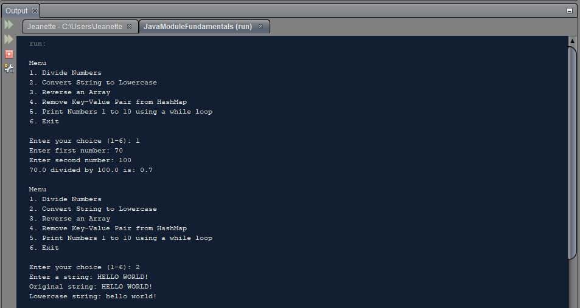
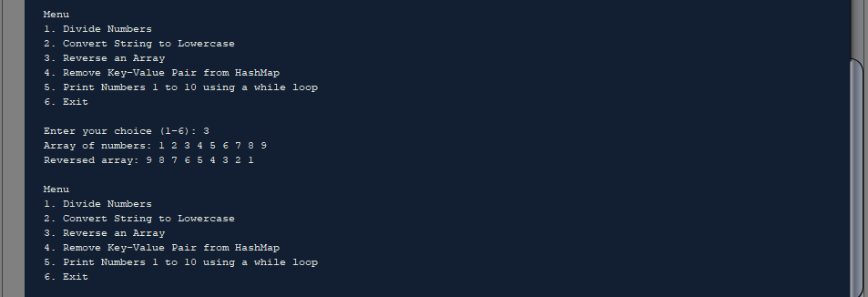
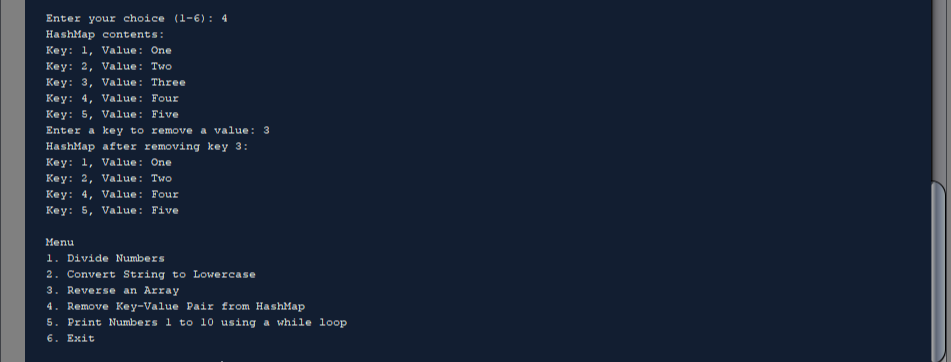
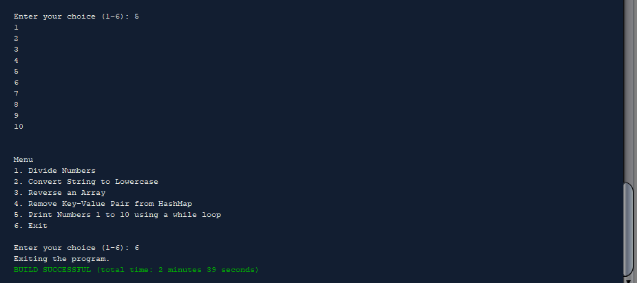

# JavaModuleFundamentals

This project contains basic Java programming tasks organized into modules. The tasks include:
1. Dividing two numbers.
2. Converting a string to lowercase.
3. Reversing an array.
4. Removing a key-value pair from a HashMap.
5. Printing numbers from 1 to 10 using a while loop.

## Screenshots of the Output

Below are the example outputs of each task:

*Figure 1: Screenshot of Divide Numbers ,Convert String to Lowercase*

*Figure 2: Screenshot of Reverse Array*

*Figure 3: Screenshot of Remove Key-Value Pair from HashMap*

*Figure 4: Screenshot of Print Numbers 1 to 10*

## License

This project is licensed under the MIT License - see the [LICENSE](LICENSE) file for details.

